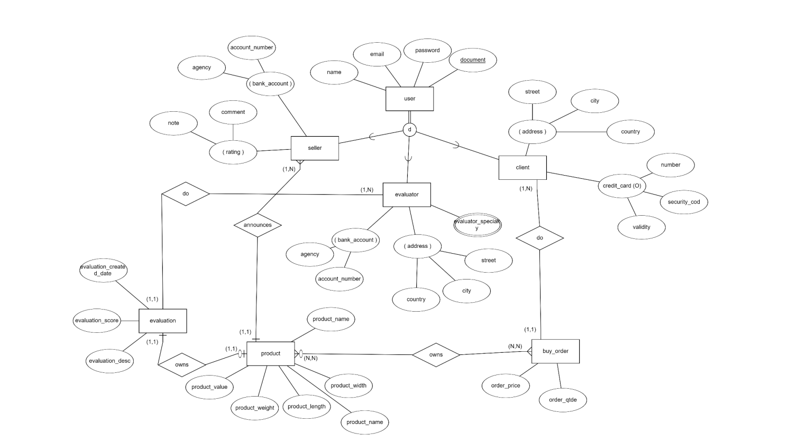
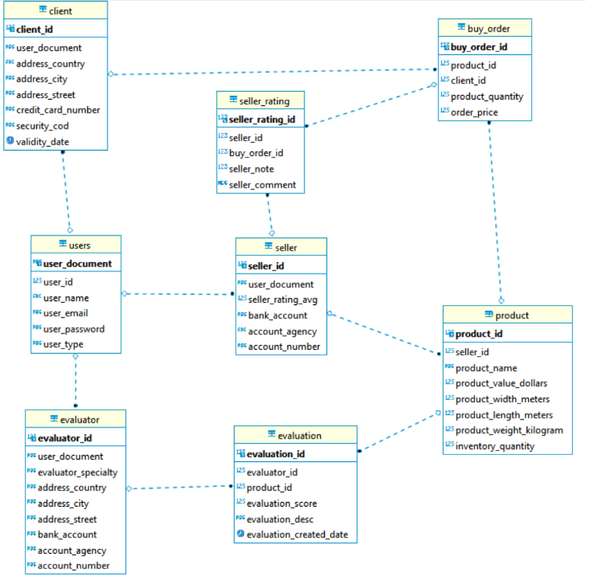
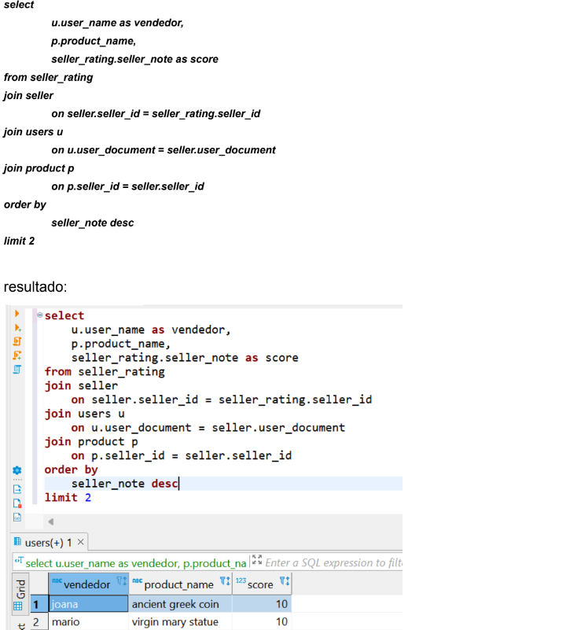

# 🐶 Universo de discurso 
### Objetivo do sistema
O projeto visa atuar no comércio de itens históricos e antiguidades. Nossa plataforma
conecta compradores e vendedores ao redor do mundo, oferecendo durante o processo de
compra o serviço de avaliação do produto realizado por um especialista, assim o comprador
tem a certeza que está adquirindo um item original.

### Principais funcionalidades e lógica de modelagem
O usuário pode ser cadastrado de três formas: como comprador, vendedor e/ou
especialista. Todos apresentam atributos comuns, como nome, email e documento.
A cada compra efetuada, um novo registro é inserido na tabela buy_order com a descrição
do pedido (quantidade e valor total).
Os produtos são anunciados por usuários do tipo vendedor, que preenchem um novo
anúncio com o valor do produto e suas especificações.
Os usuários do tipo avaliador, são especialistas em algum tipo de antiguidade (carros,
moedas, esculturas, etc) e garantem ao cliente final a certeza da originalidade do produto.

**Lógica de Modelagem**

Todos os usuários têm usuário e senha referentes a sua conta na plataforma, além disso
seu cadastro possui nome e documento. Os usuários do tipo vendedor e avaliador,
precisam cadastrar uma conta bancária para receber seus respectivos pagamentos, já os
clientes podem opcionalmente cadastrar um cartão de crédito.
O cliente pode comprar um produto anunciado e avaliar o vendedor, dando uma nota e um
comentário para sua experiência.

### Mapeamento para relacional
Descritivo de alterações realizadas por entidade:

* **seller** - mantivemos a entidade seller, onde relacionamos os dados do endereço do
vendedor, agora porém adicionamos também colunas para registro dos dados da conta
bancária, já que o vendedor precisa receber os valores das vendas por algum meio.

* **evaluator** - também mantivemos a entidade evaluator, agora também encontramos os
dados da conta bancária nessa tabela, pois o avaliador também uma remuneração por
serviço prestado.

* **client** - a tabela client se manteve praticamente a mesma, porém escolhemos adicionar as
colunas necessárias para registrar os dados de endereço e de cartão de crédito.

* **address** - removemos essa tabela pois escolhemos deixar os dados de endereço nas
tabelas evaluator e client, a entidade seller não possui endereço.

* **product** - na tabela product trocamos o campo product_type por 3 colunas que detalham
melhor o produto para que exista registro dos dados que estão na interface da aplicação. A
tabela possui um relacionamento de N:N com a tabela buy_order, ou seja, cada produto
pode pertencer a diversas ordens de compra, e uma ordem de compra pode possuir
diversos produtos.

* **evaluation** - adicionamos o campo de data da criação para que possamos analisar as
avaliações mais recentes ou mais antigas.

* **buy_order** - removemos o campo de endereço, pois agora ele é relacionado ao endereço
do próprio cliente na tabela client e adicionamos o campo price, que é fundamental para
cálculos de faturamento.

* **seller_rating** - nova tabela que tem o papel de registrar as avaliações dos vendedores.

### Diagrama de entidades

### Justificativas de não normalização
Na tabela seller, escolhemos manter um campo com a média da avaliação do vendedor
para facilitar análises e disponibilizar na plataforma essa visão aos clientes. Além disso,
também preferimos calcular o valor total da compra registrado na coluna order_price da
tabela buy_order. As demais tabelas se encontram na terceira forma normal.

### Consulta proposta
"Apresentar os 2 vendedores que possuem maiores avaliações em seus produtos
anunciados. Apresentar nome do vendedor, nome do produto anunciado e seu respectivo
score":

